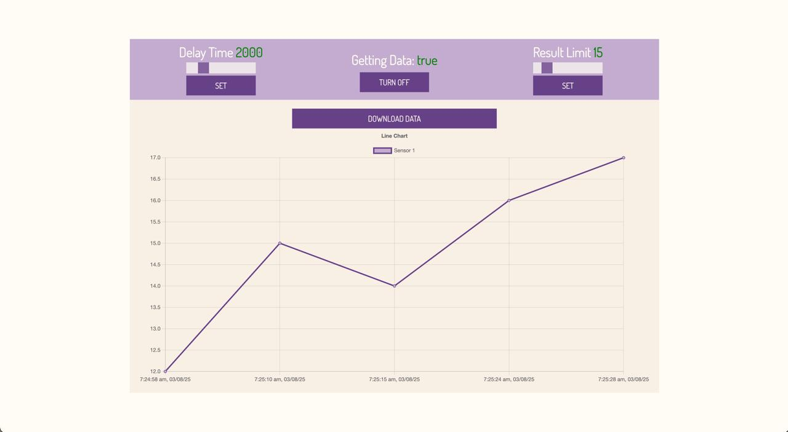

# ESP32 & Raspberry Pi IoT Data Logger

A complete IoT data logging and visualization system. This project captures analog sensor data from an ESP32, sends it to a Raspberry Pi server for logging, and displays it on a dynamic web dashboard in real-time. The dashboard can also be used to remotely control the ESP32.



## System Architecture

The project is composed of three distinct components that communicate over a WiFi network:

`[ESP32] <---HTTP---> [Raspberry Pi Server] <---HTTP/WebSocket---> [React Web Client]`

1.  **ESP32 Sensor Node**: Connects to WiFi and runs two parallel tasks using FreeRTOS. One task reads sensor data and sends it to the server. The other periodically fetches configuration (like data rate) from the server, allowing for remote updates without a restart.
2.  **Raspberry Pi Server**: A Node.js application that acts as the central hub. It exposes a REST API for the ESP32 and the web client, logs all incoming sensor data to a `data.json` file, and uses WebSockets to push live updates to the dashboard.
3.  **React Web Dashboard**: A user interface for visualizing the data in a real-time chart. It also provides controls to start/stop data collection and change the polling frequency on the ESP32 by making API calls to the server.

## Features

- **Real-time Visualization**: Sensor data is displayed on a live-updating line chart using Chart.js.
- **Remote Control**: Start, stop, and configure the ESP32's data collection rate directly from the web UI.
- **Efficient Multitasking**: The ESP32 uses FreeRTOS to handle sensor reading and configuration polling simultaneously without blocking.
- **Data Persistence**: All sensor readings are timestamped and saved to a JSON file on the server.
- **Data Export**: Download the complete dataset as a JSON file from the dashboard.

## Setup & Installation

You will need to set up each of the three components.

### 1. Raspberry Pi (Server)

1.  Clone this repository onto your Raspberry Pi.
2.  Navigate to the server directory: `cd path/to/server`.
3.  Install the dependencies: `npm install`.
4.  Start the server: `npm start`.
    _The server will run on port 5000 by default. Note the IP address of your Raspberry Pi._

### 2. ESP32 (Sensor Node)

1.  Open the ESP32 `.ino` file in the Arduino IDE or PlatformIO.
2.  **Configure Network Settings**:
    - Update the `ssid` and `password` with your WiFi credentials.
    - Change the `baseUrl` to your Raspberry Pi's IP address and port (e.g., `String baseUrl = "http://192.168.1.10:5000";`).
3.  **Hardware Connection**: Connect your analog sensor to pin **33** on the ESP32.
4.  Upload the code to your ESP32. You can monitor the serial output to see its connection status and IP address.

### 3. React (Web Dashboard)

1.  Open a new terminal on your development machine.
2.  Navigate to the client directory: `cd path/to/client`.
3.  Install the dependencies: `npm install`.
4.  **Configure Backend URI**:
    - Create a `.env` file in the client directory.
    - Add the following line, replacing the URL with your Raspberry Pi's server address:
      ```
      REACT_APP_BACKEND_URI=[http://192.168.1.10:5000](http://192.168.1.10:5000)
      ```
5.  Start the React development server: `npm start`.

## How to Use

1.  Ensure the Raspberry Pi server is running and the ESP32 is powered on and connected to your WiFi.
2.  Start the React application and open it in your browser (usually `http://localhost:3000`).
3.  On the dashboard, use the "Turn on" button to start data collection.
4.  Adjust the "Delay Time" slider and click "Set" to change how often the ESP32 sends data.
5.  Watch the chart update in real-time as data arrives from the ESP32!
